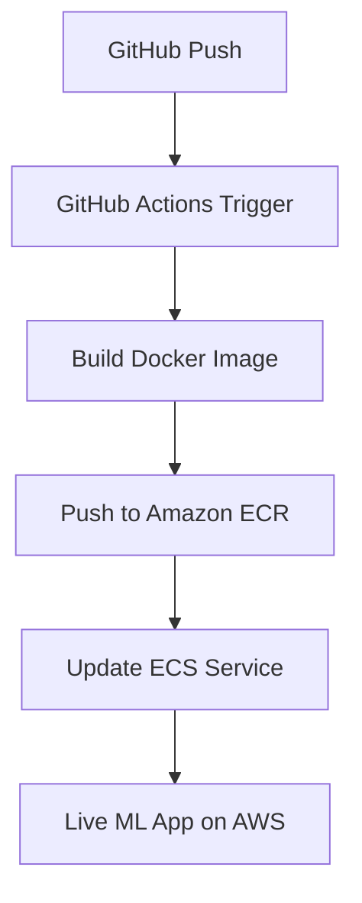

# 🚀 Machine Learning Project Documentation  
**Day 12: CI/CD Deployment to AWS via GitHub Actions**

## 🎯 Goal  
Automate the deployment of your containerized ML application to AWS using GitHub Actions, integrating with Amazon ECR and ECS.

---

## ✅ Prerequisites

| Requirement            | Description                                                                 |
|------------------------|-----------------------------------------------------------------------------|
| AWS Account            | With IAM user and programmatic access                                      |
| GitHub Repository      | Contains your ML project and Dockerfile                                    |
| Amazon ECR             | Elastic Container Registry for storing Docker images                      |
| Amazon ECS             | Elastic Container Service for running containers                          |
| IAM Role & Permissions | Access to ECR, ECS, and CloudWatch                                         |
| GitHub Secrets         | Store AWS credentials securely                                              |

---

## 🔐 GitHub Secrets Configuration

Go to your GitHub repo → Settings → Secrets → Actions → Add the following:

| Secret Name             | Description                          |
|-------------------------|--------------------------------------|
| `AWS_ACCESS_KEY_ID`     | IAM user's access key                |
| `AWS_SECRET_ACCESS_KEY` | IAM user's secret key                |
| `AWS_REGION`            | e.g., `us-east-1`                    |
| `ECR_REPOSITORY`        | Your ECR repo name                   |
| `ECS_CLUSTER`           | Your ECS cluster name                |
| `ECS_SERVICE`           | Your ECS service name                |

---

## 🧱 GitHub Actions Workflow

Create the file:  
`.github/workflows/aws-deploy.yml`

```yaml
name: Deploy to AWS

on:
  push:
    branches:
      - main

jobs:
  deploy:
    runs-on: ubuntu-latest

    steps:
    - name: Checkout code
      uses: actions/checkout@v3

    - name: Configure AWS credentials
      uses: aws-actions/configure-aws-credentials@v2
      with:
        aws-access-key-id: ${{ secrets.AWS_ACCESS_KEY_ID }}
        aws-secret-access-key: ${{ secrets.AWS_SECRET_ACCESS_KEY }}
        aws-region: ${{ secrets.AWS_REGION }}

    - name: Log in to Amazon ECR
      id: login-ecr
      uses: aws-actions/amazon-ecr-login@v1

    - name: Build, tag, and push Docker image
      run: |
        IMAGE_TAG=latest
        docker build -t ${{ secrets.ECR_REPOSITORY }}:$IMAGE_TAG .
        docker tag ${{ secrets.ECR_REPOSITORY }}:$IMAGE_TAG ${{ steps.login-ecr.outputs.registry }}/${{ secrets.ECR_REPOSITORY }}:$IMAGE_TAG
        docker push ${{ steps.login-ecr.outputs.registry }}/${{ secrets.ECR_REPOSITORY }}:$IMAGE_TAG

    - name: Deploy to Amazon ECS
      uses: aws-actions/amazon-ecs-deploy-task-definition@v1
      with:
        task-definition: ecs-task-def.json
        service: ${{ secrets.ECS_SERVICE }}
        cluster: ${{ secrets.ECS_CLUSTER }}
        wait-for-service-stability: true
```

---

## 📁 Task Definition File

Create `ecs-task-def.json` in your repo root:

```json
{
  "family": "ml-app-task",
  "containerDefinitions": [
    {
      "name": "ml-app-container",
      "image": "<your-ecr-uri>/ml-app-image:latest",
      "memory": 512,
      "cpu": 256,
      "essential": true,
      "portMappings": [
        {
          "containerPort": 5000,
          "hostPort": 5000
        }
      ]
    }
  ]
}
```

> Replace `<your-ecr-uri>` with your actual ECR URI.

---

## 🔄 Workflow Summary



---

## ✅ Output
- Fully automated deployment from GitHub to AWS  
- Docker image built and pushed to ECR  
- ECS service updated with new image  
- App live and accessible via public endpoint
